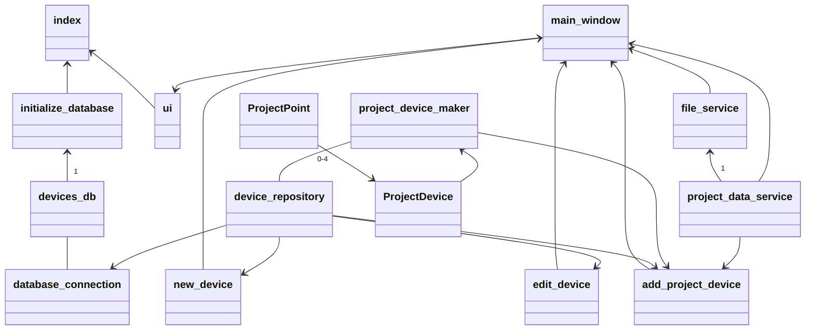

# Arkkitehtuurikaavio  

  
# Rakenne ja toiminnallisuus yleisesti.
Ohjelman rakenteessa on kolme tasoa.  
- UI: Käyttöliittymän koodi.  
- Services: Sovelluslogiikan koodi.  
- Entities: Sovelluksen käyttämät tietoa sisältävät luokat.  
- Repositories: Tietojen tallennus ja haku tietokannasta.
  
# Käyttöliittymästä  
Ohjelmassa on tällä hetkellä seuraavat ikkunat:  
Päänäkymä - Sisältää projektiin lisätyt laitteet ja pisteet.  
Uuden laitteen lisäys tietokantaan - Mahdollistaa laitteiden tallennuksen pysyvästi.  
Tietokannan laitteen muokkaus - Tästä ikkunasta käsin voi muokata tietokantaan tallennettua tietoa.  
Lisää laite projektiin - Täältä voi valita, mitä tietokantaan tallennettuja laitteita halutaan lisätä projektiin. Pisteet lisätään automaattisesti.  
  
Jokainen ikkuna on oma luokkansa, joiden näyttämisestä vastaa UI-luokka. Käyttöliittymä on pääosin erillinen sovelluslogiikasta. Muutamia sovelluslogiikan osia on kuitenkin vielä käyttöliittymän luokissa.  
  
# Sovelluslogiikka  
Sovelluksen tietoja hallinnoi project_data_service -luokka. Sinne lisätään projektiin lisätyt laitteet. project_device -luokka kuvaa projektin laitteita. Jokaisen project_device -luokan alla on project_point -olioita, jotka kuvaavat lisättyjen laitteiden pisteitä.  
File_service -luokka vastaa projektin tietojen tallentamisesta. Tällä hetkellä tuettuna on vain excel yhteensopiva CSV -tiedostomuoto.
  
project_device_maker -luokka tarjoaa metodit project_device -olioiden ja niiden alla olevien project_point -olioiden luomiseen.  
  
# Projektin tietojen tallennus  
Projektin tiedot on mahdollista tallentaa CSV -muodossa. Tällä hetkellä erottavaa merkkiä ei ole mahdollista valita, vaan ohjelma käyttää aina pilkkua (,).  
Tiedot tallennetaan riveittäin. Jokaisella rivillä on ensin yhden laitteen tiedot ja sen jälkeen laitteen pisteiden pistetunnukset. Muita pisteiden tietoja ei tallenneta, sillä ne on mahdollista erotella pisteen nimestä tarvittaessa.  
Yksi laite per rivi.
